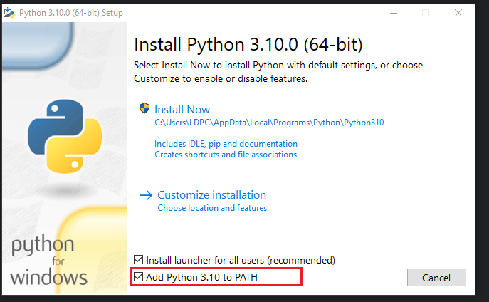
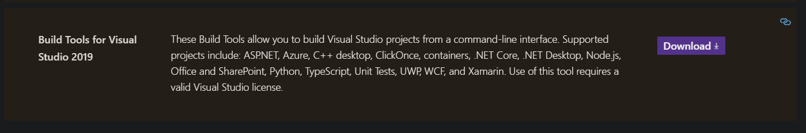
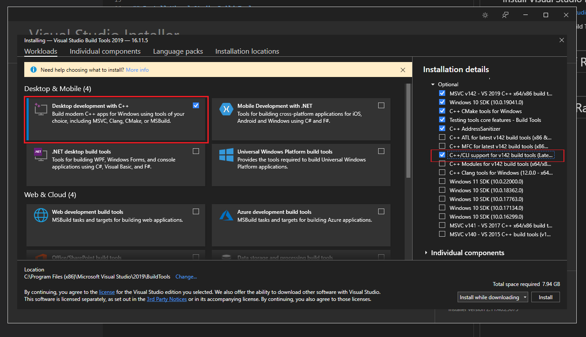

# pre-requirements

## Install Python

1. Go to https://www.python.org/downloads/windows/
   
2. Download latest Stable release (Use the 64Bit Installer)

    **Rasa requires Python 3.6, 3.7, or 3.8! We use 3.8.10 for now**
   
   https://www.python.org/ftp/python/3.8.10/python-3.8.10-amd64.exe

3. When installing also add PATH to environment variables (see image)



---

## Install Visual Studio Build Tools

1. Go to https://visualstudio.microsoft.com/downloads/#build-tools-for-visual-studio-2019

2. Download the VS Build Tools



3. Select Desktop development with C++ and also check the optional option "C++/CLI support" as shown in the image



and then hit install!

---

# Install Rasa 

## Create a virtual environment

Go to your desired installation directory for rasa and create a virtual environment

```
python -m venv [Virtual Environment Name]

example:
python -m venv rasa_venv
```

Activate the virtual environment
```
.\[Virual Environment Name]\Scripts\activate

example:
.\rasa_venv\Scripts\activate
```

If you want to deactivate the virtual environment:
```
deactivate
```

---

##  Intallation of Rasa Open Source (Base Software)

1. First we upgrade pip if there is an upgrade. For this step we need to exit the 
virtual environment with 

    ```
    deactivate
    ```

    then try to upgrade pip

    ```
    pip3 install --upgrade --user pip
    ```

    Now we activate the virtual environment again

    ```
    .\rasa_venv\Scripts\activate
    ```

2. Install Rasa Open Source

    ```
    pip install rasa
    ```

    If you get the error: No module named pip then run ```python -m ensurepip``` first

3. Now initialize Rasa
   
    ```
    rasa init
    ```


##  Intallation of Rasa X (Extension)

1. Go to your directory where you installed rasa base and activate the virtual environment again if you deactivated it 

2. ```pip install rasa-x --extra-index-url https://pypi.rasa.com/simple```

3. ```pip install SQLAlchemy==1.3.22``` This is for some reason missing and has to be installed afterwards

4. ```rasa x```
   
   If rasa x is still not opening the ui then try deleting the events*-files + rasa.db file
   
